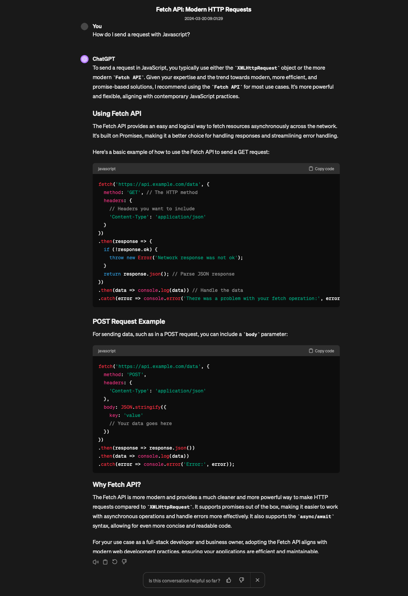

# chatgpt-export

Format and download ChatGPT conversations to markdown, JSON, and PNG for sharing and exporting chat logs.

Exports the active ChatGPT chat log directly from the browser console.

## Usage

 1. Navigate to [chat.openai.com/chat](https://chat.openai.com/chat).
 2. Open the chat thread you'd like to export.
 3. Follow the below steps depending on which output type you'd like.

### JSON

1. Open browser console
2. Copy and paste this function:

`fetch('https://raw.githubusercontent.com/vrocky/chatgpt-export/main/dist/json.min.js').then(response => response.text()).then(text => eval(text))`

OR:

1. Copy contents of `/dist/json.min.js`
2. Paste into browser console

### Markdown

1. Open browser console
2. Copy and paste this function:

`fetch('https://raw.githubusercontent.com/vrocky/chatgpt-export/main/dist/md.min.js').then(response => response.text()).then(text => eval(text))`

OR:

1. Copy contents of `/dist/md.min.js`
2. Paste into browser console

### Markdown with Math Latex

1. Open browser console
2. Copy and paste this function:

`fetch('https://raw.githubusercontent.com/vrocky/chatgpt-export/main/dist/md2.min.js').then(response => response.text()).then(text => eval(text))`

OR:

1. Copy contents of `/dist/md2.min.js`
2. Paste into browser console

### Image (.PNG)

1. Open browser console
2. Copy and paste this function:

`fetch('https://raw.githubusercontent.com/vrocky/chatgpt-export/main/dist/image.min.js').then(response => response.text()).then(text => eval(text))`

OR:

1. Copy contents of `/dist/image.min.js`
2. Paste into browser console

#### Example output:

## Limitations

This is a trivial implementation as ChatGPT currently does not support sharing or exporting conversations. It may break with future changes.

It currently supports:
- Paragraphs / Text
- Lists
- Code blocks
- Tables
